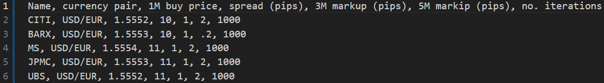
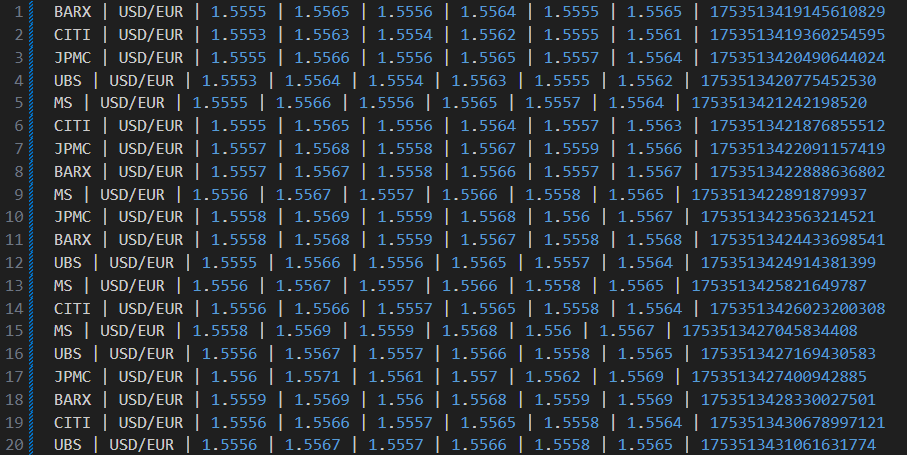
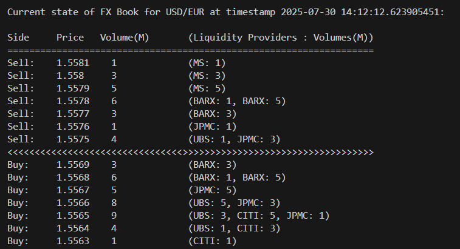

 # FX Simulator and Aggregator - fx_sim_agg_gui

 `fx_sim_agg_gui` simulates FX market data streams and aggregates them into a real-time book of buys and sells. It is written in Rust to allow concurrent, fast, memory-safe  programming without garbage collection pauses.

 A separate thread renders the FX updates in real-time to a GUI:

A simplified software architecture is as shown:

 - `main.rs`  Defines and initiates the UI runtime (which in turn intiates the asynchronous fx simulation and aggregation runtime). Also initiates log4rs logging framework
 - `simulator.rs` generates simulated FX market data and sends the data as asynchronous market data streams
 - `aggregator.rs` updates and aggregates the asynchronous data streams into a real-time FX book of buys and sells
 - `lib.rs` Includes the thread which combines all the individual asynchronous market data streams from each liquidity provider into a single merged stream
 that yields values in the order they arrive from the source market data streams. Also incudes the FxViewerApp structure which initiates and updates the GUI. Various utilities used by the other modules are also in this library.
  - `gui.rs` Contains the definition of the GUI components and how to render them.

Configuration of the different liquidity providers is via an input config file:

 "FIX" like market data is generated for the different liquidity providers and saved in a FIX.log:

The aggregated FX book is updated and rendered to the screen in a real-time GUI and also displayed in real-time as a ladder in the terminal window as shown below:

**TODO** 
1. Real-time graphical display of generated FX data
2. Real-time trades from the aggregated FX book